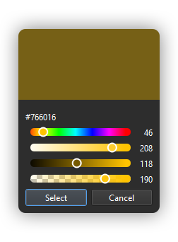

# QColorPicker



This repository contains the source code of a modernized version of Qt's color picker widget.

## Features

* Modernized look and feel
* Quick option to pick a color

## Usage

```cpp
#include <QColorPicker>

// ...

QColorPicker picker;
picker.exec();
qDebug() << picker.color();

// ...
```

## License

This project is licensed under the MIT License - see the LICENSE file for details.

## Acknowledgments

[Qt](https://github.com/qt/qtbase) for the GUI framework
